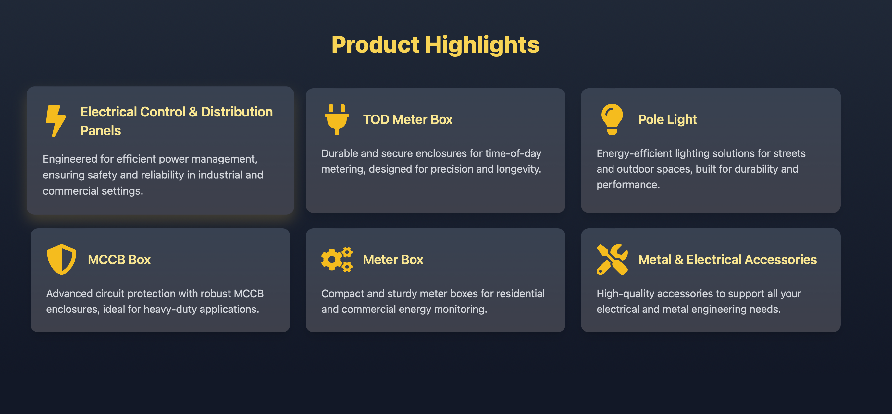
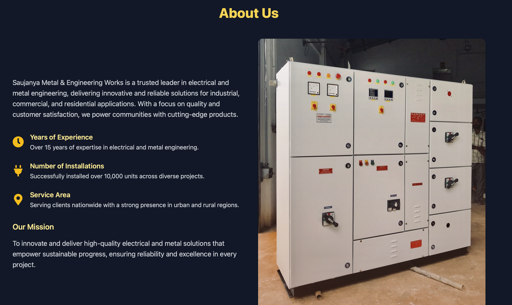
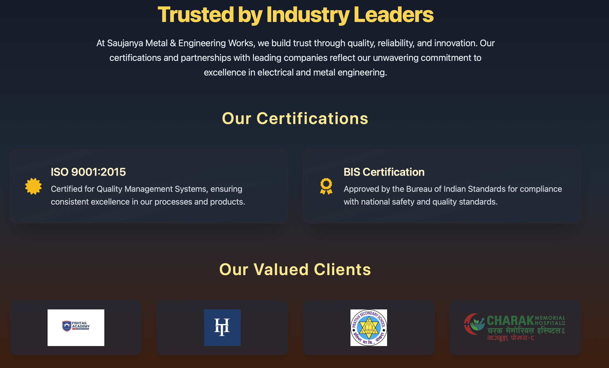
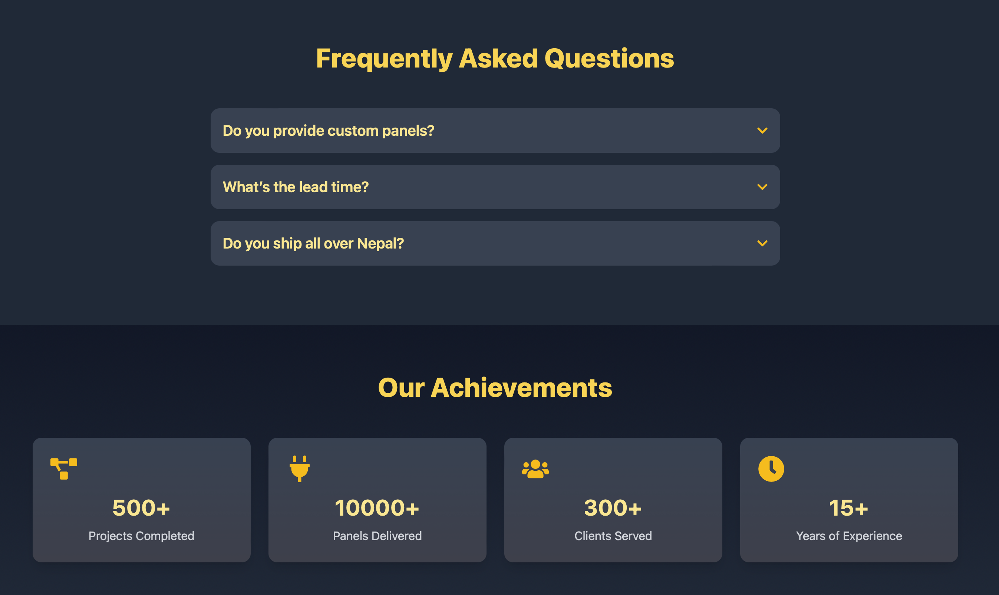

# Saujanya Metals & Engineering Works - Landing Page

A visually engaging multi-section landing page built using **React**, **Tailwind CSS**, and **Framer Motion**, designed as a practice project for the company **Saujanya Metals & Engineering Works**.
## 🚀 Tech Stack

- **React** – JavaScript library for building user interfaces
- **Tailwind CSS** – Utility-first CSS framework
- **Framer Motion** – For smooth animations and transitions

## 📌 Features

- **Home Section** – Introduction to the company with a strong visual impact
- **Card Section** – Showcases key offerings, services, or categories
- **About Section** – Describes the mission, vision, and values
- **Testimonials** – Customer reviews and feedback
- **Certificates** – Display of business certifications and trust indicators
- **FAQs** – Frequently Asked Questions to help users quickly understand offerings
- **Stats** – Business stats like years in service, clients, and completed projects
- **Footer** – Contact details, social links, and essential links

## 📸 Screenshots

